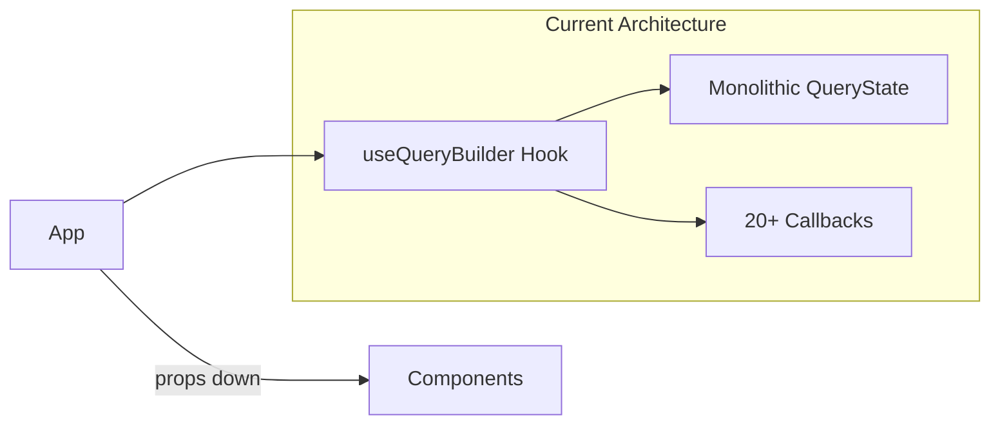
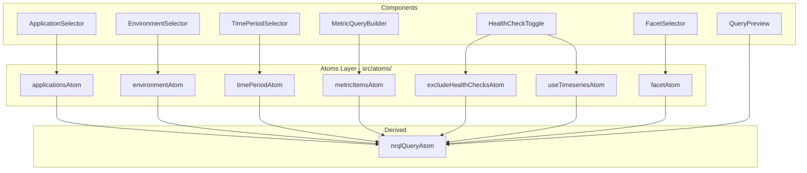

# Migrate to Jotai Atoms

## Current State

The `useQueryBuilder` hook manages a monolithic `QueryState` object with 20+ callbacks. This creates tight coupling and requires prop-drilling through the component tree.



## Target Architecture



## File Structure

```
src/
├── atoms/
│   ├── index.ts              # Barrel export
│   ├── primitives.ts         # Simple primitive atoms
│   ├── metricItems.ts        # Metric items atom + actions
│   ├── derived.ts            # nrqlQueryAtom (derived from all)
│   └── actions.ts            # applyPreset, reset
├── lib/
│   └── buildNrqlQuery.ts     # Pure function (extracted from hook)
```

## Atom Design

**Primitive atoms** (`atoms/primitives.ts`):

- `applicationsAtom` - writable `Application[]`
- `environmentAtom` - writable `Environment`
- `timePeriodAtom` - writable `TimePeriod`
- `excludeHealthChecksAtom` - writable `boolean`
- `useTimeseriesAtom` - writable `boolean`
- `facetAtom` - writable `FacetOption`

**Complex atom** (`atoms/metricItems.ts`):

- `metricItemsAtom` - writable `MetricQueryItem[]`
- Helper atoms for add/update/remove metric items and filters using `atom` with write functions

**Derived atom** (`atoms/derived.ts`):

- `nrqlQueryAtom` - read-only derived atom that calls `buildNrqlQuery()`

**Action atoms** (`atoms/actions.ts`):

- `applyPresetAtom` - write-only atom that batch-updates multiple atoms
- `resetAtom` - write-only atom that resets all to defaults

## Component Migration

Components will use `useAtom()`, `useAtomValue()`, or `useSetAtom()` directly:

```tsx
// Before
function ApplicationSelector({ selectedApplications, onToggle }) {...}

// After
function ApplicationSelector() {
  const [applications, setApplications] = useAtom(applicationsAtom);
  const toggle = (app: Application) => {
    setApplications(prev => 
      prev.includes(app) ? prev.filter(a => a !== app) : [...prev, app]
    );
  };
  ...
}
```

## Key Changes

- **App.tsx**: Remove `useQueryBuilder()` call, wrap app in `<Provider>` from Jotai
- **Components**: Each component imports only the atoms it needs
- **Tests**: Update to render within a Jotai `<Provider>`, mock atoms as needed
- **buildNrqlQuery**: Remains a pure tested function, moved to `src/lib/`

## Dependencies

Add `jotai` package (latest version via npm).

## Migration Order

1. Install jotai, create atoms structure
2. Extract `buildNrqlQuery` to `src/lib/buildNrqlQuery.ts`
3. Create primitive atoms
4. Create metric items atom with action helpers
5. Create derived nrqlQueryAtom
6. Create applyPreset/reset action atoms
7. Migrate App.tsx (add Provider)
8. Migrate each component one-by-one
9. Update tests
10. Delete old `useQueryBuilder.ts`